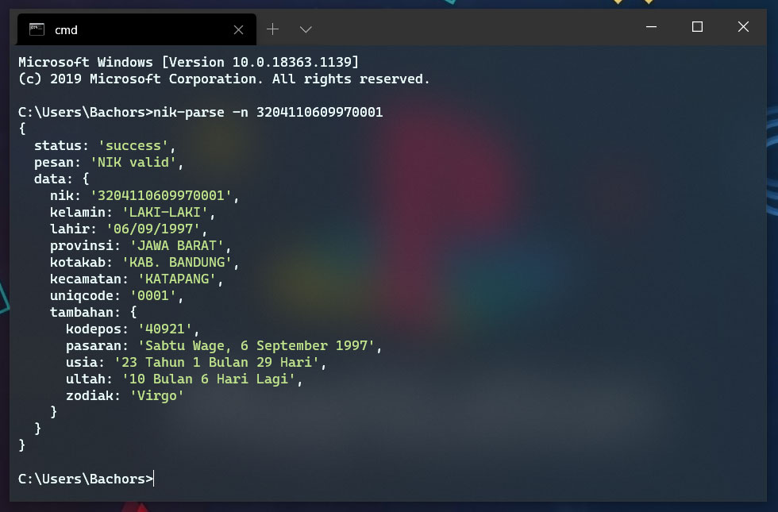

Parse & Validasi Nomor Induk Kependudukan (NIK) KTP Menggunakan Javascript.

<h3>- <a href="#nik_parsejs">nik_parse.js</a></h3>
<h3>- <a href="#nik-parse-cli">nik-parse cli</a></h3>
<h3>- <a href="#nik_parserts">nik_parser.ts</a></h3>

---------------------------------------------------------------

Rumus


# <a href="https://github.com/bachors/nik_parse.js/tree/master/src">nik_parse.js</a>
Sample
```html
<script type="text/javascript" src="src/nik_parse.js"></script>
<script>
	const nik = "3204110609970001";
	nikParse(nik, function(result) {
		console.log(result); // object
	});	
</script>
```

Result
```json
{
  "status": "success",
  "pesan": "NIK valid",
  "data": {
    "nik": "3204110609970001",
    "kelamin": "LAKI-LAKI",
    "lahir": "06/09/1997",
    "provinsi": "JAWA BARAT",
    "kotakab": "KAB. BANDUNG",
    "kecamatan": "KATAPANG",
    "uniqcode": "0001",
    "tambahan": {
      "kodepos": "40921",
      "pasaran": "Sabtu Pahing, 6 September 1997",
      "usia": "23 Tahun 1 Bulan 27 Hari",
      "ultah": "10 Bulan 8 Hari Lagi",
      "zodiak": "Virgo"
    }
  }
}
```

<h2><a href="http://bachors.com/code/validasi-nik-ktp-menggunakan-javascript-nik_parsejs?embed">DEMO</a></h2>

# <a href="https://www.npmjs.com/package/nik-parse">nik-parse cli</a>
Install
```
npm i nik-parse -g
```

Command
```
nik-parse --nik 3204110609970001
```
Alias
```
nik-parse -n 3204110609970001
```


# <a href="https://github.com/mul14/nik_parser.ts?fbclid=IwAR0yu4Vadmdi13Z9rVNyiSIuZuybq2bD1THGNTQqZMQNanYvjsCVN9HldR0">nik_parser.ts</a>
NIK Parser in TypeScript by @mul14.

# note
Data yang dihasilkan hanya hasil menterjemahkan tiap digit NIK sehingga data yang dihasilkan adalah tempat pertamakali NIK dibuat/tempat lahir (bukan tempat domisili pemilik NIK secara uptodate).
